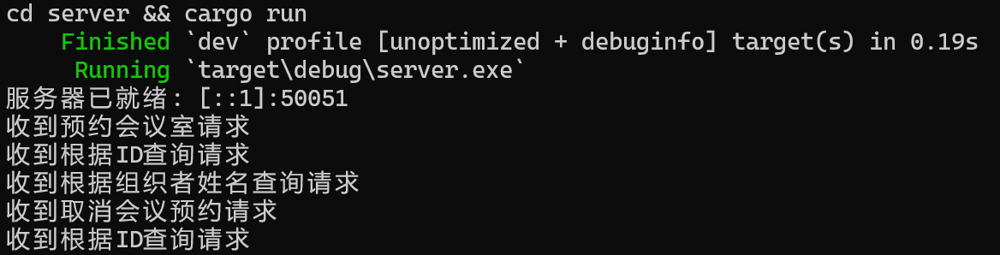
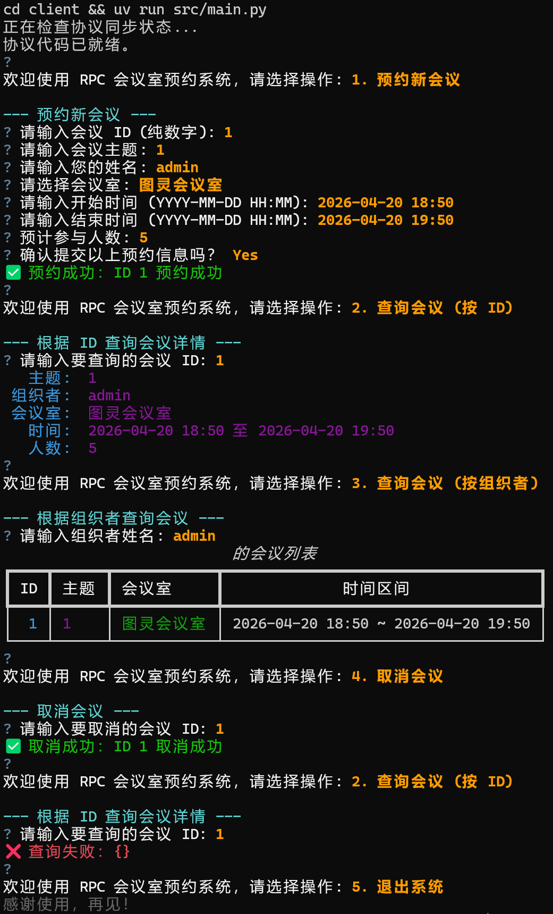

# meeting-booking-system

基于 gRPC 的会议室预约系统，服务端使用 `Rust` 实现，客户端使用 `Python` 提供交互式命令行界面。

## 前置条件

* `Cargo`
* `uv`
* [Protocol Buffer 编译器](https://protobuf.com.cn/installation/)
* `make`（快速开始方式一需要）

## 项目结构

```text
meeting-booking-system/
├── assets/
│   ├── client.png
│   └── server.png
├── client/                     # Python 客户端
│   ├── src/
│   │   ├── main.py             # 主程序入口
│   │   └── service.py          # gRPC 客户端封装
│   ├── .gitignore
│   ├── .python-version
│   ├── pyproject.toml
│   └── uv.lock
├── proto/                      # gRPC 接口定义
│   └── meeting.proto
├── server/                     # Rust gRPC 服务器
│   ├── src/
│   │   └── main.rs             # 主程序入口
│   ├── .gitignore
│   ├── build.rs                # 构建脚本
│   ├── Cargo.lock
│   └── Cargo.toml
├── .gitignore
├── Makefile
└── README.md
```

## 接口说明

基于 gRPC 协议，定义于 `proto/meeting.proto`。

### `Meeting` 数据结构

| 字段 | 类型 | 说明 |
| ------ | ------ | ------ |
| `meeting_id` | int32 | 会议 ID（唯一标识） |
| `organizer_name` | string | 组织者姓名 |
| `room_name` | string | 会议室名称 |
| `subject` | string | 会议主题 |
| `start_time` | int64 | 开始时间（Unix 时间戳） |
| `end_time` | int64 | 结束时间（Unix 时间戳） |
| `participant_count` | int32 | 参与人数 |

### BookMeeting

预约会议。请求参数为完整的 `Meeting` 对象，返回是否成功及提示信息。

### QueryById

按 ID 查询会议详情。请求参数为 `meeting_id`，返回对应的 `Meeting` 对象。

### QueryByOrganizer

按组织者查询会议列表。请求参数为 `organizer_name`，返回 `Meeting` 列表。

### CancelMeeting

取消会议。请求参数为 `meeting_id`，返回是否成功及提示信息。

## 快速开始

### 方式一：使用 `make`

```bash
# 启动服务器
make run-server
```

```bash
# 启动客户端
make run-client
```

### 方式二：手动启动

```bash
# 启动服务器
cd ./server && cargo run
```

```bash
# 启动客户端
cd ./client && uv run src/main.py
```

## 示例

服务端



客户端


